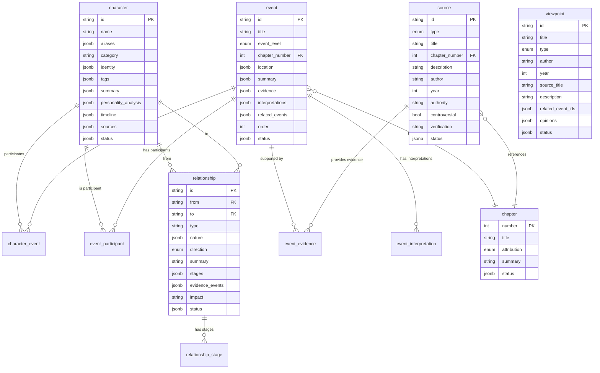

# 01 — ER Diagram（实体关系图）

## 1. 主表（6 张）

```
┌─────────────────────────────────────────────────────────────────┐
│                        RedMansion KB Schema                      │
├─────────────────────────────────────────────────────────────────┤
│                                                                  │
│   ┌──────────────┐       ┌──────────────────┐                   │
│   │   character   │       │     chapter      │                   │
│   ├──────────────┤       ├──────────────────┤                   │
│   │ id (PK)      │       │ number (PK)      │                   │
│   │ name         │       │ title            │                   │
│   │ aliases[]    │       │ attribution      │ → enum: caoxueqin│
│   │ category     │       │ summary          │    / gaoe         │
│   │ identity     │       │ status           │                   │
│   │ tags[]       │       └──────┬───────────┘                   │
│   │ summary      │              │                                │
│   │ personality_ │              │                                │
│   │   analysis[] │              │                                │
│   │ timeline[]   │              │                                │
│   │ sources[]    │              │                                │
│   │ status       │              │                                │
│   └──────┬───────┘              │                                │
│          │                      │                                │
│   ┌──────┴──────────────────────┴──────────────┐                │
│   │                 event                       │                │
│   ├─────────────────────────────────────────────┤                │
│   │ id (PK)                                    │                │
│   │ title                                      │                │
│   │ event_level → major / minor / micro        │                │
│   │ chapter_number (FK → chapter.number)       │                │
│   │ location                                   │                │
│   │ summary                                    │                │
│   │ evidence[] → { source_id, quote, note }    │                │
│   │ interpretations[]                          │                │
│   │ related_events[]                           │                │
│   │ order (叙事顺序)                            │                │
│   │ status                                     │                │
│   └──────┬─────────────────────────────────────┘                │
│          │                                                      │
│   ┌──────┴──────────────────────────────────────┐               │
│   │              source                          │               │
│   ├──────────────────────────────────────────────┤               │
│   │ id (PK)                                     │               │
│   │ type → original_text / zhi_ping             │               │
│   │          / hongxue_paper                    │               │
│   │ title                                       │               │
│   │ chapter_number (FK → chapter.number)        │               │
│   │ description                                 │               │
│   │ author? (红学论文必填)                        │               │
│   │ year?                                       │               │
│   │ authority                                   │               │
│   │ controversial (boolean)                     │               │
│   │ verification                                │               │
│   │ status                                      │               │
│   └──────────────────────────────────────────────┘               │
│                                                                  │
│   ┌──────────────────┐    ┌──────────────────┐                  │
│   │   relationship   │    │    viewpoint     │                  │
│   ├──────────────────┤    ├──────────────────┤                  │
│   │ id (PK)          │    │ id (PK)          │                  │
│   │ from (FK→char)   │    │ title            │                  │
│   │ to (FK→char)     │    │ type → academic  │                  │
│   │ type             │    │    / popular /   │                  │
│   │ nature[]         │    │    disputed      │                  │
│   │ direction        │    │ author           │                  │
│   │ → mutual/one-way │    │ year             │                  │
│   │ summary          │    │ source_title     │                  │
│   │ stages[]         │    │ description      │                  │
│   │ → {stage, title, │    │ related_event_ids│                  │
│   │   chapter,       │    │ opinions[]       │                  │
│   │   description}   │    │ → {side, content,│                  │
│   │ evidence_events[]│    │   proponent}     │                  │
│   │ impact           │    │ status           │                  │
│   │ status           │    └──────────────────┘                  │
│   └──────────────────┘                                          │
│                                                                  │
└─────────────────────────────────────────────────────────────────┘
```

## 2. 连接表（4 张）

```
   ┌─────────────────────┐
   │   character_event   │    N:N — 人物参与事件的时间线
   ├─────────────────────┤
   │ character_id (FK)   │
   │ event_id (FK)       │
   │ role                │ ← 在该事件中的角色
   │ note?               │
   │ order               │ ← 该人物叙事序中的序号
   └─────────────────────┘

   ┌─────────────────────┐
   │  event_participant  │    N:N — 事件参与人物明细
   ├─────────────────────┤
   │ event_id (FK)       │
   │ character_id (FK)   │
   │ role                │ ← 参与者/见证者/提及者/受影响者
   │ description?        │
   └─────────────────────┘

   ┌─────────────────────┐
   │   event_evidence    │    N:N — 事件↔证据来源
   ├─────────────────────┤
   │ event_id (FK)       │
   │ source_id (FK)      │
   │ quote               │ ← 原文引文
   │ note                │ ← 说明/批注
   └─────────────────────┘

   ┌──────────────────────┐
   │ relationship_stage   │    1:N — 关系阶段时间线
   ├──────────────────────┤
   │ relationship_id (FK) │
   │ stage_order          │ ← 阶段序号
   │ title                │ ← 阶段标题
   │ chapter_number (FK)  │
   │ description          │
   └──────────────────────┘

   ┌──────────────────────┐
   │ event_interpretation │    1:N — 事件解读（多观点并存）
   ├──────────────────────┤
   │ event_id (FK)        │
   │ type                 │ ← 红学/文学/心理分析
   │ title                │
   │ content              │
   │ source_ref?          │
   └──────────────────────┘
```

## 3. Mermaid ER（可渲染版本）


