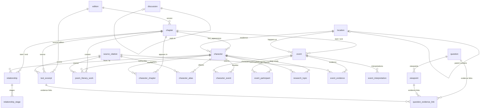

# Red Mansion Knowledge Base — Schema V2 Design

> 版本：v2.0  
> 基于：`OPENCODE_CONTENT_DATABASE_FRAMEWORK.md` + `CONTENT_DEPTH_STANDARD.md`  
> DDL 文件：`02-schema-v2.sql`

---

## 1. 设计原则

1. **人物是骨架，问题是钩子，事件/章节/原文是事实层，观点/证据是理解层，讨论是社区层。**
2. 所有核心内容表标注 `fact_type`，禁止模糊事实边界。
3. 三级内容深度（L1/L2/L3）驱动渐进式内容建设，先建骨架再做深度。
4. UUID 主键 + 语义 slug 双标识系统，兼顾技术扩展性与人工可读性。
5. 保留 v1 所有有效表与字段，无破坏性变更。

---

## 2. 实体关系图



---

## 3. 表设计说明

### 3.1 edition（版本）

**用途**：统一管理《红楼梦》版本信息（程甲本、程乙本、庚辰本、脂评本等）。

| 字段 | 说明 |
|------|------|
| `id` | UUID 主键 |
| `name` | 版本全称（如「程乙本」） |
| `short_code` | 短码（如 `chengyi`） |
| `year` | 出版/抄写年份 |
| `description` | 版本特征说明 |

**设计理由**：v1 无版本表，版本信息散落在各字段中。v2 将版本独立管理，避免重复和维护不一致。

---

### 3.2 chapter（章节）

**v2 变更**：新增 `edition_id`、`summary`（独立 TEXT 字段）、`major_characters`（JSONB 快照）。

| 字段 | 变更 | 说明 |
|------|------|------|
| `id` | **NEW** | UUID 主键，代替原 `number` 单字段主键 |
| `chapter_number` | 保留 | 唯一约束，1–120 |
| `edition_id` | **NEW** | 指向版本表 |
| `summary` | **NEW** | 独立文本字段，不再嵌在 JSONB 中 |
| `major_characters` | **NEW** | JSONB 数组，快速查询本章主要人物 |
| `embedding_status` | **NEW** | 向量化状态追踪 |

**设计理由**：章节表从「元数据表」升级为「可探索的内容入口」。`major_characters` 字段让前端可以不联表查询即可渲染章节人物卡片。

---

### 3.3 location（地点，NEW）

**用途**：首页大观园地图、人物居所、事件空间。

自引用 `parent_location_id` 支持层级：大观园 → 潇湘馆 / 怡红院 / 蘅芜苑。

| 字段 | 说明 |
|------|------|
| `slug` | 稳定标识，如 `xiaoxiang-guan` |
| `location_type` | residence / garden / mansion / courtyard / temple 等 |
| `map_x` / `map_y` | 大观园地图坐标 |
| `asset_key` | 地点视觉资源路径 |
| `fact_type` | 地点是否存在版本/考证争议 |

**设计理由**：大观园是《红楼梦》的重要空间结构。独立地点表支持地图导航、空间关系探索、人物活动空间分析。

---

### 3.4 character（人物，HEAVILY ENHANCED）

**核心原则**：Character 主表只保存「人物主档案与索引」，真正内容分散在 Relationship、Event、Question、Viewpoint、Evidence 等关联表中。

| 新增字段 | 类型 | 说明 |
|----------|------|------|
| `slug` | TEXT UNIQUE | 稳定标识，如 `lin-daiyu` |
| `gender` | gender_type | male / female / unknown |
| `short_intro` | TEXT | 80–150 字快速认识 |
| `identity_summary` | TEXT | 身份一句话总结 |
| `family_group` | TEXT | 家族归属（贾府 / 林家 / 史家 等） |
| `first_appearance_chapter_id` | UUID FK | 首次出场章节 |
| `importance_level` | ENUM | core / major / secondary |
| `content_level` | ENUM | L1 / L2 / L3 |
| `asset_key` | TEXT | 人物视觉资源路径 |
| `sort_weight` | INTEGER | 排序权重 |
| `birth_origin_summary` | TEXT | 出身概述 |
| `fate_summary` | TEXT | 结局概述 |
| `residence_location_id` | UUID FK | 主要居所 |
| `fact_type` | ENUM | 人物信息的事実等级 |
| `keywords` | JSONB | 3–8 个关键词 |
| `notes_internal` | TEXT | 内部备注 |

**保留的 v1 字段**：`category`、`identity`（JSONB）、`tags`（JSONB）、`personality_analysis`（JSONB）、`confidence`、`verified_by`。

**设计理由**：v1 的 `aliases` 嵌入在 JSONB 中，v2 独立为 `character_alias` 表。`content_level` 驱动渐进式内容建设流程。

---

### 3.5 character_alias（别名，NEW）

**用途**：支持人物别名 / 称谓的完整管理。

| 字段 | 说明 |
|------|------|
| `alias` | 别名文本（如「颦颦」「潇湘妃子」） |
| `alias_type` | courtesy / nickname / title / family_address / servant_address |
| `context` | 使用场景说明 |
| `source_id` | 出处引用 |
| `fact_type` | 事实等级 |

**设计理由**：v1 将别名存在 `character.aliases` JSONB 中，无法被有效检索和管理。独立表支持全文搜索别名、按类型过滤、关联来源。

---

### 3.6 relationship（人物关系，ENHANCED）

**v2 变更**：列名从 `"from"/"to"` 改为 `from_character_id/to_character_id`，新增时间范围、强度权重、事实等级。

| 新增字段 | 说明 |
|----------|------|
| `start_chapter_id` | 关系开始章节 |
| `end_chapter_id` | 关系结束章节 |
| `strength_weight` | 关系强度（用于图谱渲染） |
| `fact_type` | 事实等级 |
| `evidence_ids` | 支撑该关系的证据 ID 列表（JSONB） |
| `source_ids` | 来源引用列表（JSONB） |

**保留 v1 字段**：`nature`（关系本质枚举数组）、`stages`（JSONB 阶段记录）、`impact`。

---

### 3.7 event（事件，HEAVILY ENHANCED）

**v2 变更**：新增 `slug`、`event_type`、起止章节 `start_chapter_id/end_chapter_id`、`location_id`、`importance_weight`、`fact_type`、`source_ids`。

| 新增字段 | 说明 |
|----------|------|
| `slug` | 稳定标识，如 `daiyu-buries-flowers` |
| `summary` | TEXT 独立字段（v1 在 JSONB 中） |
| `event_type` | personal / social / political / ceremonial / tragic / poetic 等 |
| `start_chapter_id` | 事件起始章节 |
| `end_chapter_id` | 事件结束章节（跨回事件支持） |
| `location_id` | 事件发生地点 |
| `importance_weight` | 重要度权重 |
| `fact_type` | 事实等级 |
| `source_ids` | 关联来源 |

**保留 v1 字段**：`event_level`（major / minor / micro）、`evidence`（JSONB）、`interpretations`（JSONB）、`related_events`（JSONB）、`confidence`。

---

### 3.8 source_citation（来源引用，v1 source 重命名）

**变更**：表名从 `source` 改为 `source_citation`，新增 `credibility_level`（A/B/C/D 四等）、`publisher`、`edition`、`url`。

| 字段 | 说明 |
|------|------|
| `source_type` | original_text / academic_book / academic_paper / zhi_ping 等 |
| `credibility_level` | A（原著/学术专著）→ D（社区帖子） |
| `chapter_id` | 关联章节（原 `chapter_number INTEGER` → UUID FK） |

**设计理由**：`source` 是 PostgreSQL 保留字，改用 `source_citation` 避免冲突。四级可信度等级确保内容质量可追溯。

---

### 3.9 text_excerpt（原文短证据，NEW）

**用途**：人物、问题、观点、事件的原文依据。

| 字段 | 说明 |
|------|------|
| `quote_short` | 短原文摘录 |
| `context_summary` | 上下文概述 |
| `evidence_type` | 证据类型分类 |
| `fact_type` | 事实等级 |
| `copyright_note` | 版权说明 |
| `embedding_status` | 向量化状态 |

**版权规则**：只保存短摘录，不批量保存整章原文，必须保留章节与版本来源。

---

### 3.10 question（问题，NEW）

**用途**：网站最重要的用户探索钩子。

| 字段 | 说明 |
|------|------|
| `slug` | 稳定标识 |
| `title` | 问题标题（如「黛玉为什么葬花？」） |
| `short_summary` | 简短概述 |
| `neutral_overview` | 50–150 字中立概述（禁止只写「有人认为……也有人认为……」） |
| `question_type` | character / relationship / event / plot / theme / symbol / version |
| `importance_weight` | 内容重要度 |
| `heat_weight` | 讨论热度（可动态调整） |
| `character_ids` / `event_ids` / `chapter_ids` / `location_ids` | JSONB 关联快照 |

**设计理由**：关联快照字段（JSONB arrays）提供冗余加速查询，避免频繁 JOIN。核心关联通过 `question_evidence_link` 表维护。

---

### 3.11 viewpoint（观点，HEAVILY ENHANCED）

**用途**：支持「不同解释并存」，所有观点必须绑定到问题。

**v2 新增**：`question_id`（必填 FK）、`summary`、`argument_body`（长篇论证）、`stance_type`、`fact_type`、`source_ids`（JSONB）。

**保留 v1 字段**：`type`（academic / popular / disputed）、`author`、`year`、`source_title`、`description`、`opinions`（JSONB）、`related_event_ids`（JSONB）。

**事实等级要求**：观点默认标为 `scholarly_viewpoint`，如有版本争议标 `disputed_version`。

---

### 3.12 question_evidence_link（问题—证据—观点，NEW）

**用途**：三元关联表，记录每个证据对每个观点是支持还是削弱。

| 字段 | 说明 |
|------|------|
| `question_id` | 问题 |
| `viewpoint_id` | 观点（可为 NULL，直接关联证据到问题） |
| `evidence_id` | 原文证据 |
| `relation_type` | support / weaken / contextual / neutral |
| `weight` | 证据强度 |

**设计理由**：这是深度内容的核心结构。一个成熟问题页应呈现：2+ 观点 × 每个观点的支持证据 × 反方证据 × 版本差异。

---

### 3.13 poem_literary_work（诗词曲文，NEW）

**用途**：关联人物、章节、来源的文学作品档案。

| 字段 | 说明 |
|------|------|
| `work_type` | poem / ci / qu / song / fu / couplet / riddle / letter 等 |
| `author_character_id` | 作者人物（黛玉的诗、宝玉的诗） |
| `symbolic_notes` | 象征意义分析 |

---

### 3.14 discussion（讨论，NEW）

**用途**：社区讨论层。首期只需定义接口，不要求完整开发。

多态目标设计：`target_type`（character / question / event / chapter）+ `target_id`。

自引用 `parent_post_id` 支持嵌套回复。

---

### 3.15 research_topic（深度研究专题，NEW）

**用途**：L3 人物深度红学档案。`CONTENT_DEPTH_STANDARD.md` §6 定义了 15 种 `topic_type`。

| 字段 | 说明 |
|------|------|
| `character_id` | 关联人物（必填） |
| `body` | 专题正文（可数万字） |
| `topic_type` | biography / personality / relationship / poetry / symbolism / version_study 等 |
| `source_ids` | 引用来源 |

**设计理由**：L3 人物不要求写成一篇长文，而是拆成多个可查询、可关联、可复用的 ResearchTopic 数据单元。

---

### 3.16 连接表（从 v1 保留并增强）

| 表 | v2 变更 |
|----|--------|
| `character_event` | 新增 `fact_type` |
| `event_participant` | 新增 `fact_type` |
| `event_evidence` | `source_id` 指向 `source_citation`（原名 `source`），新增 `fact_type` |
| `event_interpretation` | 无变更 |
| `relationship_stage` | `chapter_number` → `chapter_id`（UUID FK） |

### 3.17 character_chapter（NEW）

**用途**：直接记录人物在哪些章节中出现，支持「林黛玉出场章节列表」等查询。`character_event` 提供事件级关联，`character_chapter` 提供章节级关联。

---

## 4. 关键变更：v1 → v2

| 维度 | v1 | v2 |
|------|----|----|
| 主键策略 | TEXT 语义 ID（如 `character_lin_daiyu`） | UUID + slug 双标识 |
| 事实分层 | 无 | 所有核心表 `fact_type` ENUM |
| 内容深度 | 无层级 | L1/L2/L3 三级 + content_level 字段 |
| 别名管理 | character.aliases JSONB | character_alias 独立表 |
| 问题 / 观点 | 问题表不存在，观点未绑定问题 | question + viewpoint 1:N，通过 question_evidence_link 三元关联 |
| 地点 | 嵌在 event.location JSONB | location 独立表，支持地图坐标与大观园层级 |
| 版本 | 无 | edition 表 + 多表 edition_id FK |
| 诗词 | 无 | poem_literary_work 独立表 |
| 社区 | 无 | discussion 多态关联表 |
| 深度研究 | 无 | research_topic 表，支持 L3 人物 |
| 来源表名 | source（PostgreSQL 保留字风险） | source_citation |
| 章节主键 | chapter_number INTEGER PK | UUID PK + chapter_number UNIQUE |
| 来源可信度 | 无 | credibility_level A/B/C/D |
| 人物视觉 | 无 | asset_key 字段（只存路径，不存储图片） |
| embedding_status | 部分表有 | 所有文本重表都有 |

---

## 5. fact_type 使用指南

所有核心内容表（character、relationship、event、text_excerpt、question、viewpoint、poem_literary_work、research_topic、location、character_alias）均包含 `fact_type` 字段。

```
canonical_text_fact  → 原著明确写出的事实（如「黛玉住潇湘馆」）
text_inference       → 根据原文做出的推断（如「贾母偏爱黛玉」）
scholarly_viewpoint  → 红学研究、学者、注本中的解释
adaptation_only      → 影视剧、舞台剧等改编设定
disputed_version     → 版本差异、后四十回争议、脂评争议
```

### 规则

1. **禁止把 `text_inference` 标为 `canonical_text_fact`。**
2. **禁止把影视剧设定混入原著事实。** 影视改编内容必须标 `adaptation_only`。
3. **观点并存，不强行给唯一答案。** 同一问题下允许多个 `scholarly_viewpoint` 并列。
4. **来源不足时保留 `draft`，不得标为 `verified`。**
5. **不得凭语言模型常识「补齐」不确定事实。**

### 典型场景

| 内容 | 正确 fact_type | 错误标注 |
|------|---------------|---------|
| 黛玉父林如海，巡盐御史 | canonical_text_fact | — |
| 黛玉死因：病死（程高本） | disputed_version | canonical_text_fact |
| 87 版《红楼梦》黛玉结局 | adaptation_only | canonical_text_fact |
| 贾母支持「木石前盟」 | text_inference | canonical_text_fact |
| 「钗黛合一」理论（俞平伯） | scholarly_viewpoint | canonical_text_fact |

---

## 6. L1 / L2 / L3 内容等级

| 等级 | 目标 | 典型内容量 | 适用人物 |
|------|------|-----------|---------|
| **L1** | 建档，系统可展示 | 基本身份 + 3 关系 + 2 事件 + 3 问题 | 次要人物、Phase 1 初始化 |
| **L2** | 完整人物库，可探索 20–60 min | 20–50 问题 + 20–40 事件 + 20–40 关系 + 30+ 章节 + 20+ 证据 + 多观点 | 金陵十二钗、贾宝玉、贾母等 |
| **L3** | 深度红学档案，独立研究入口 | L2 全部 + 14 ResearchTopic + 数万字内容 | Tier S（黛玉、宝玉、宝钗、凤姐） |

### 升级流程

```
Phase 1: 全部人物 → L1（建骨架）
Phase 2: 核心人物 → L2（填充事件、关系、问题）
Phase 3: Tier S 人物 → L3（ResearchTopic）
Phase 4: 社区层（Discussion）
```

`content_level` 字段在 `character` 表中，由内容建设流程驱动升级，不手动设置。

---

## 7. ID 命名规范

| 标识类型 | 格式 | 示例 |
|----------|------|------|
| UUID 主键 | `uuid_generate_v4()` | `a1b2c3d4-...` |
| character slug | 拼音全名，小写，下划线 | `lin-daiyu`, `jia-bao-yu` |
| event slug | 英文短描述 | `daiyu-buries-flowers` |
| location slug | 拼音全名 | `xiaoxiang-guan` |
| question slug | 英文关键描述 | `why-daiyu-buries-flowers` |
| edition short_code | 罗马拼音缩写 | `chengyi`, `gengchen` |

slug 对前端路由友好，UUID 保证数据迁移和分布式一致性。

---

## 8. embedding_status 策略

以下表包含 `embedding_status` 字段，用于追踪向量化状态：

- `character`、`chapter`、`event`、`text_excerpt`
- `question`、`viewpoint`、`poem_literary_work`
- `research_topic`、`relationship`

状态流转：`pending` →（向量化服务处理）→ `indexed` / `failed`

---

## 9. 索引策略

- **B-tree 索引**：所有外键、状态字段、排序字段、枚举字段。
- **GIN trigram 索引**：`character.name`、`character_alias.alias` 支持模糊搜索。
- **GIN JSONB 索引**：`character.tags`、`character.keywords`、`question.character_ids`、`question.event_ids`、`relationship.evidence_ids`、`chapter.major_characters`。
- **GIN 全文搜索索引**：`event.summary`、`question.title/neutral_overview`、`viewpoint.argument_body/description`、`text_excerpt.quote_short`、`research_topic.body/summary`、`poem_literary_work.quote_short`。使用 `simple` 配置支持中文分词。

---

## 10. 执行说明

```bash
# 创建数据库
createdb redmansion_kb_v2

# 执行 DDL
psql redmansion_kb_v2 < docs/knowledge-base/02-schema-v2.sql

# 验证
psql redmansion_kb_v2 -c "\dt"
psql redmansion_kb_v2 -c "\dT"
```

### 注意事项

1. 需要 PostgreSQL 14+ 和 `uuid-ossp`、`pg_trgm` 扩展。
2. `BEGIN...COMMIT` 包裹全部 DDL，任一失败则全回滚。
3. 索引与触发器的创建顺序不影响最终效果。
4. `character_coverage` 视图可在每 Phase 完成后执行以输出覆盖报告。
